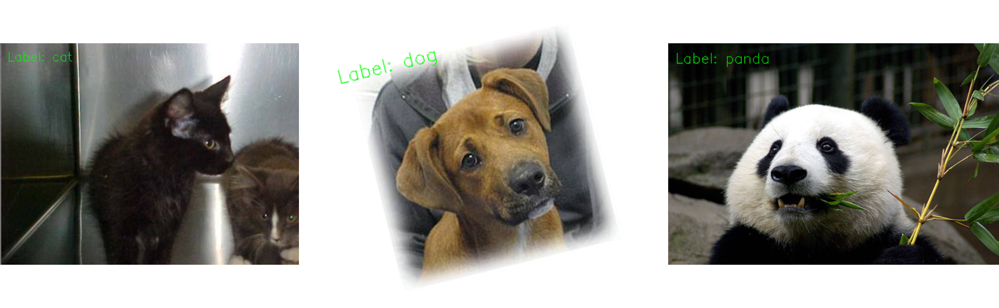

# Computer vision project  
<!--배너이미지 추가 영역-->


<!--뱃지 추가 영역-->
<!--버전--> <!--최종 수정일--> <!--진행현황(active/진행중, on-hold/중지, completed/완료-->
  

<!--과제 수행범위 추가영역-->
[x] 데이터 수집
[x] 데이터 전처리
[x] 데이터 분석 및 시각화
[x] 모델링 및 튜닝
[ ] 모델 배포


## 목 차(Table of contents)  
[1. 개 요(Abstract)](#1-개-요abstract)
[2. 요구사양(Requirements)](#2-요구사양requirements)
[3. 설치 방법(Installation)](#3-설치-방법installation)
[4. 프로젝트 구성(Project structure)](#4-프로젝트-구성project-structure)
[5. 사용방법(Usage examle)](#5-사용방법usage-examle)
  - [데이터 준비](#데이터-준비)
  - [데이터 전처리](#데이터-전처리)
  - [모델 학습](#모델-학습)
  - [모델 예측](#모델-예측)
[6. 개정이력(Release note)](#6-개정이력release-note)
[7. 참여 직원(Contributors)](#7-참여-직원contributors)


## 1. 개 요(Abstract)
[(목차로 이동)](#1-개-요abstract)  
- CNN(Convolutional Neural Network)을 사용하여 동물 이미지(고양이, 개, 판다)를 분류하는 모델 개발
- opencv를 사용하여 모델 구동 시 분류(예측) 결과를 이미지 위에 문자로 표시 


## 2. 요구사양(Requirements)
[(목차로 이동)](#1-개-요abstract)   

- python 3.6
- tensorflow 2.2
- sklearn 0.22.1
- numpy 1.18.1
- matplotlib 3.1.3
- opencv-python 4.2.0
- imutils 0.5.3

## 3. 설치 방법(Installation)
[(목차로 이동)](#1-개-요abstract)     

저장소에서 프로젝트 파일을 내려 받는다.
```
$ git clone https://github.com/sguys99/computer_vision_project.git
```
요구사양 라이브러리를 설치한다.
```
$ pip install -r requirements.txt
```
      
## 4. 프로젝트 구성(Project structure)
[(목차로 이동)](#1-개-요abstract)  

```
├── dataset/
│   ├── 01_row/                    <- The original dataset.
│   ├── 02_interim/                <- Intermediate data that has been transformed.
│   ├── 03_processed/              <- The final, canonical data sets for modeling.
│   └── 04_external/               <- Data from third party sources.
│
├── docs/                          <- Generated analysis reports.
├── notebooks/                     <- Jupyter notebook files.
├── references/                    <- Data dictionaries, manuals, and all other materials.
│
├── src/
│   ├── data/                      <- Dataset for training models.
│   ├── mllib/
│   │   └── conv/                  <- modules for customized models. architectures.
│   ├── models/                    <- trained model weights.
│   ├── outputs/                   <- results on model evaluation. 
│   ├── utils/                     <- libraries to build models
│   ├── 01_data_preparation.py     <- scripts to download or generating data
│   ├── 02_build_features.py       <- scripts to turn raw data into features for modeling
│   ├── 03_train.py                <- scripts to train models
│   └── 04_predict.py              <- scripts to make predictions
│
├── environment.yml
├── README.md
└── requirements.txt
```
  
## 5. 사용방법(Usage examle)
[(목차로 이동)](#1-개-요abstract)  

#### 데이터 준비
캐글(Kaggle) `Animal Image Dataset(Dog, Cat and Panda` 데이터셋을 다운로드한다.[[download link]](https://www.kaggle.com/ashishsaxena2209/animal-image-datasetdog-cat-and-panda)  
다운로드한 데이터는 `src/data/` 경로에 저장한다. 데이터셋 폴더 구조는 다음과 같이 설정한다.
```
└── src/
    └── data/
         ├── cats/
         ├── dogs/
         └── panda/
```
#### 데이터 전처리
해당사항 없음(모델 학습 과정에서 진행)

#### 모델 학습
`mllib/conv/shallownet.py`에 정의된 CNN 모듈을 사용하여 모델을 구성하고 학습한다.
```
사용법 : $ python 03_train.py [-d] [-m]

arguments 
  -d, --data    :   path to input dataset. required 
  -m, --model   :   path to trained model(weights). required
  -o, --output  :   path to train results(train history). optional
```

예 시:  
데이터셋이 `data/animal/` 경로에 저장되어 있고, 학습된 모델과 학습결과를 각각  `models/model.hdf5`, `/outputs/output.png` 경로에 저장하고자 할때 다음과 같이 입력한다.  
```
$ python 03_train.py -d data/animal -m models/model.hdf5 -o ouputs.png
```
#### 모델 예측
데이터셋에서 10장의 이미지를 랜덤 추출하여 분류 동작을 수행한다. 
```
사용법 : $ python 04_predict.py [-d] [-m] 

arguments 
  -d, --data    :   path to input dataset. required 
  -m, --model   :   path to pre-trained model(weights). required
```
예 시:
데이터셋과 학습된 모델이 각각 `data/animal/`, `models/model.hdf5` 경로에 저장되어 있을 때 다음과 같이 입력한다.  
```
$ python 04_predict.py -d data/animal -m models/model.hdf5
```

## 6. 개정이력(Release note)
[(목차로 이동)](#1-개-요abstract)  
- **v1.0 (2020.11.02)**
  - v1.0 등록 및 배포
- **v1.1 (2020.11.20)** 
  - 처리속도 개선 : pandas 연산부분을 numpy로 대체

## 7. 참여 직원(Contributors)
[(목차로 이동)](#1-개-요abstract)  

|소 속     |  이름    |  담당업무         |  연락처    |
|--------- |---------|------------------|------------|
|데이터AI팀 | AAA     | 과제책임         |010-0000-0000|
|데이터AI팀 | bbb     | 데이터수집, 전처리|010-0000-0000|
|데이터AI팀 | ccc     | 모델링 및 성능평가|010-0000-0000|

